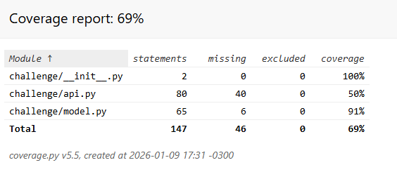
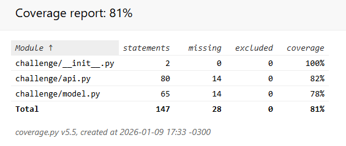
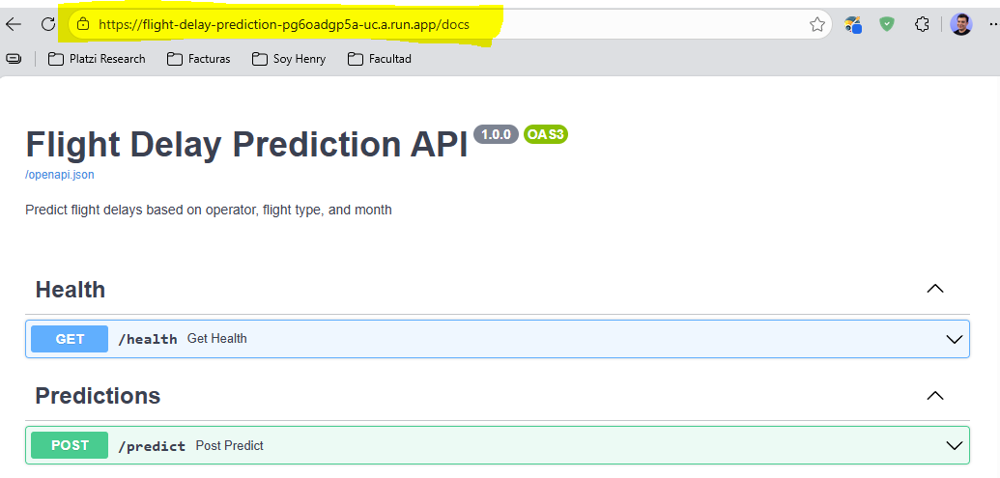
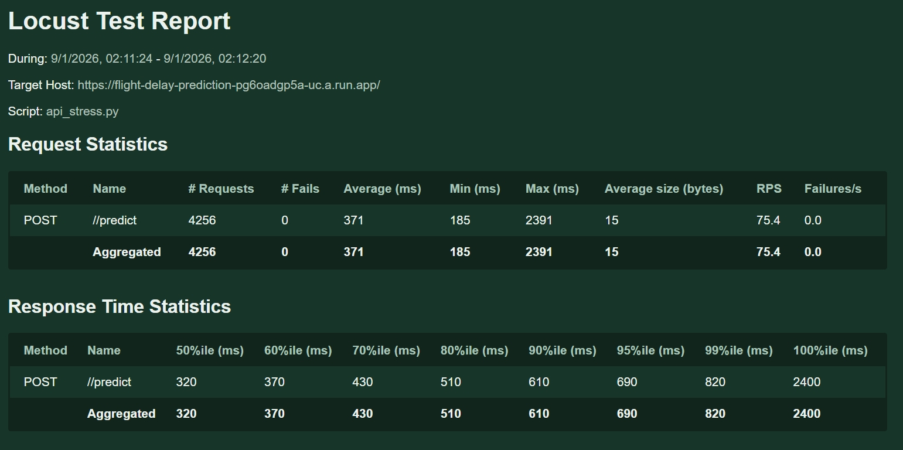
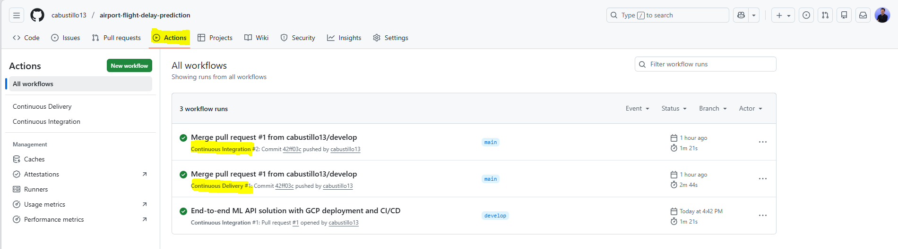

<p align="center">
 
 <h1 align="center">Carlos Bustillo</h1>
 <p align="center">This repository contains my solution to a technical challenge, along with the engineering notes and decisions taken throughout the process to keep the work well documented and reproducible.</p>
</p>

# Part 1: Model Implementation

## 1.1) Fix Features Generation

### 1) get_period_day

**Why it needs improvement**

The original implementation contains edge case bugs at time boundaries (e.g. 05:00, 11:59, 12:00) and does not correctly handle the midnight crossing for the night period.
This may result in missing or incorrect period assignments for valid flight times.

**What was improved**

Fixed inclusive time boundaries and simplified the logic to correctly classify morning, afternoon, and night periods while preserving the original function signature and output values.

### 2) is_high_season

**Why it needs improvement**

While functionally correct, the original implementation relies on fragile string parsing and duplicated datetime conversions, reducing readability and maintainability.

**What was improved**

Refactored the internal logic to use explicit datetime ranges, improving clarity, robustness, and testability without changing the original behavior or outputs.

---
## 1.2) Why ROC Curve is applied

ROC AUC is used to evaluate the model's discriminative power independently of any specific decision threshold.
By comparing ROC AUC between training and test sets, we can detect overfitting or underfitting and assess whether the model generalizes well.
This comparison helps select the most suitable model for production deployment.

---
## 1.3) Production Readiness Evaluation
In addition to predictive performance, inference latency and model size were evaluated.
These metrics are relevant for production readiness, especially when deploying the model as an API.

In production environments, latency directly impacts user experience and system scalability.
Models with similar ROC AUC scores may not be equally viable if their inference times differ significantly.

Model size was also considered, as it affects cold start times, deployment speed, and infrastructure costs

---
## 1.4) Model Selection

The objective of this project is to predict the probability of flight delays for airport takeoffs and landings.
In this context, correctly identifying delayed flights (class 1) is more critical than maximizing overall accuracy, as false negatives may lead to operational and planning issues.

For this reason, recall for the delayed class and probabilistic discrimination (ROC AUC) were prioritized over accuracy.
Models achieving high accuracy but near-zero recall for delayed flights were discarded, as they fail to meet the business objective despite appearing performant.

Among the evaluated models, only those trained with class balancing and the top 10 most important features achieved a meaningful recall for delayed flights.

While both XGBoost and Logistic Regression achieved similar ROC AUC and recall scores, Logistic Regression was selected due to its significantly lower inference latency, smaller model size, and simpler operational footprint.

These characteristics make it more suitable for production deployment as an API, without sacrificing predictive performance.

| Metric                   | XGBoost (Top 10 + Balanced) | Logistic Regression (Top 10 + Balanced) |
| ------------------------ | --------------------------- | --------------------------------------- |
| Recall (Delay = 1)       | **0.69**                    | **0.69**                                |
| Precision (Delay = 1)    | 0.25                        | 0.25                                    |
| ROC AUC (Test)           | 0.643                       | 0.640                                   |
| Accuracy                 | 0.55                        | 0.55                                    |
| Inference Latency (mean) | 2.33 ms                     | **0.91 ms**                             |
| Model Size               | 0.24 MB                     | **0.0013 MB**                           |
| Interpretability         | Low                         | **High**                                |
| Operational Complexity   | Medium                      | **Low**                                 |
| Production Suitability   | Good                        | **Excellent**                           |

**Note:** When predictive performance is comparable, the simpler and more efficient model was preferred to reduce operational risk and infrastructure costs.

**Model selected: Logistic Regression with top 10 features and class balancing (Regression 2)**

---
## 1.5) Test Data Loading Strategy (test_model.py)

The dataset path is resolved dynamically based on the test file location to ensure portability across different execution environments. Additionally, all columns are loaded as strings (dtype=str) to avoid Pandas type inference issues and mixed-type warnings, keeping data loading deterministic and delegating all type handling to the preprocessing stage.

---
## 1.6) Model tests 

The `DelayModel` implementation has been validated using automated unit tests.

Run the model tests with:
```
make model-test
```

Results:



Test and coverage artifacts are generated under the reports/ directory (excluded from version control).

---

# Part 2: FastAPI API

## 2.1) Dependency compatibility

FastAPI 0.86 / Starlette 0.20 require AnyIO < 4.

The dependency is pinned explicitly to avoid runtime errors in TestClient.

## 2.2) API tests

Run the api tests with:
```
make api-test
```

Results:



---

# Part 3: Cloud Deployment

## 3.1) Python Version Selection

It's crucial to explicitly define the Python version in the Dockerfile to ensure deterministic builds every time the Docker image is created, rather than relying on `python:latest`.

I chose Python 3.10 because it's a recent and stable version well-suited for cloud deployments, and it matches my local development environment for consistency across environments.

---

## 3.2) Deployment to Google Cloud Platform (Cloud Run)

This API was deployed to **Google Cloud Platform (GCP)** using **Cloud Run**, following a container-based, serverless approach focused on scalability, cost control, and reproducibility.

The deployment was designed to support **load and stress testing** while keeping infrastructure simple and cost-efficient.

### Architecture Decisions

* **Cloud Run (managed)** was chosen instead of VMs or Kubernetes:

  * Automatic horizontal scaling
  * Pay-per-use billing model
  * Zero idle cost (`min-instances = 0`)
  * Native support for containerized FastAPI applications

* **Docker-first approach**:

  * Ensures environment reproducibility
  * Same image is used locally and in the cloud
  * Eliminates "works on my machine" issues

* **Stateless API design**:

  * Model inference is lightweight
  * No persistent storage required
  * Ideal for serverless deployment

---

### Initial GCP Setup

```bash
# 1. Install gcloud CLI
# https://cloud.google.com/sdk/docs/install

# 2. Authenticate
gcloud auth login

# 3. Create project
gcloud projects create flight-delay-api-483816 --name="flight-delay-api"

# 4. Set active project
gcloud config set project flight-delay-api-483816

# 5. Enable required APIs
gcloud services enable run.googleapis.com
gcloud services enable cloudbuild.googleapis.com
```

Note: Billing was enabled manually via the GCP Console, which is required for Cloud Run deployments.

---

### Docker-based Deployment

The API is built and deployed using **Google Cloud Build**, which automatically builds and pushes the Docker image.

#### Deployment Script (`deploy-gcp.sh`)

Key configuration decisions:

* **Memory**: 2Gi (to safely support pandas + sklearn)
* **CPU**: 1
* **Concurrency**: 80 (optimized for FastAPI async handling)
* **Max instances**: 10 (to cap scaling and cost)
* **Timeout**: 60s
* **Unauthenticated access** (required for stress testing)

Deployment command:

```bash
./deploy-gcp.sh
```

Or via Makefile:

```bash
make deploy-gcp
```

After deployment, the script outputs the **public Cloud Run URL**.

```
STRESS_URL = https://flight-delay-prediction-pg6oadgp5a-uc.a.run.app/
```



---

#### Local vs Cloud Testing (Makefile Support)

The Makefile was extended to support **both local Docker testing and GCP deployment**, enabling fast iteration and parity between environments.

#### Local Docker Testing

```bash
make docker-build
make docker-run
```

Endpoints:

* API: [http://localhost:8080](http://localhost:8080)
* Health check: [http://localhost:8080/health](http://localhost:8080/health)
* Docs: [http://localhost:8080/docs](http://localhost:8080/docs)

#### GCP Operations

```bash
make deploy-gcp
make gcp-logs
make gcp-delete
```

---

### Stress Testing

Stress tests are executed using **Locust**, as required by the challenge.

#### Stress Test Configuration

* **Users**: 100
* **Spawn rate**: 1 user/sec
* **Duration**: 60 seconds
* **Endpoint tested**: `/predict`

The target URL is configurable in the Makefile:

```makefile
STRESS_URL = https://flight-delay-prediction-pg6oadgp5a-uc.a.run.app/
```

#### Test Command

```bash
make stress-test
```

---

#### Stress Test Results (Summary)

- **0% request failures**
- ~4,200 total requests
- **~75–90 requests/sec sustained**
- **Median latency ~320 ms**
- **99th percentile < 1 second (most cases)**
- Occasional high-latency outliers due to Cloud Run cold starts



This confirms:

* The API scales correctly under load
* Cloud Run handles concurrency efficiently
* Model inference latency is acceptable for real-time usage

---

### Cost Control & Billing Safety

To avoid unexpected charges during stress testing and experimentation, the following safeguards were implemented:

* **Billing Budgets and Alerts**:

  * Alerts configured at multiple thresholds (e.g. 50%, 75%, 90%, 100%)
  * Email notifications enabled

* **Autoscaling limits**:

  * `max-instances` explicitly capped
  * Prevents runaway scaling

* **Serverless-first design**:

  * No idle costs
  * Infrastructure exists only while requests are being processed

This ensures the project remains **safe, predictable, and cost-efficient**.

---

### Final Outcome

* API successfully deployed on GCP
* Stress tests passed as required by the challenge
* Infrastructure designed with production best practices
* Cost risks mitigated with budgets and scaling limits

---

## Part 4: CI / CD

A **CI/CD pipeline** was implemented using **GitHub Actions**.

### Continuous Integration (CI)

The CI workflow runs on pull requests and pushes to `main` and ensures code correctness before deployment by:

* Setting up Python 3.10
* Installing dependencies
* Running **model unit tests**
* Running **API tests**

This guarantees stability of both the ML pipeline and the FastAPI service.

---

### Continuous Delivery (CD)

The CD workflow is triggered on pushes to `main` and automatically deploys the application to **Google Cloud Run** by:

* Authenticating securely with GCP
* Building the Docker image
* Deploying the service with controlled resources and autoscaling

Only validated code reaches production.

---

### Stress tests

Stress tests are **intentionally excluded from CI**.

They are executed manually against Docker or Cloud Run environments, since load tests are non-deterministic, infrastructure-dependent, and costly to run on every pipeline execution. This keeps CI fast, reliable, and reproducible.



**Note:** I used **Gitflow** and **Conventional Commits**, keeping develop as the integration branch and main as the final deliverable.
All features were merged into develop, and I opened a single PR to main once the solution was complete and all tests passed.

--- 

## Part 5: Future Improvements

- Add data drift monitoring once production data is available (e.g., monitoring distribution shifts in OPERA, MES, and TIPOVUELO).
- Reduce Cloud Run cold starts by configuring minimum instances and optimizing container startup time.
- Introduce request batching or lightweight caching for frequent prediction patterns to improve tail latency.

